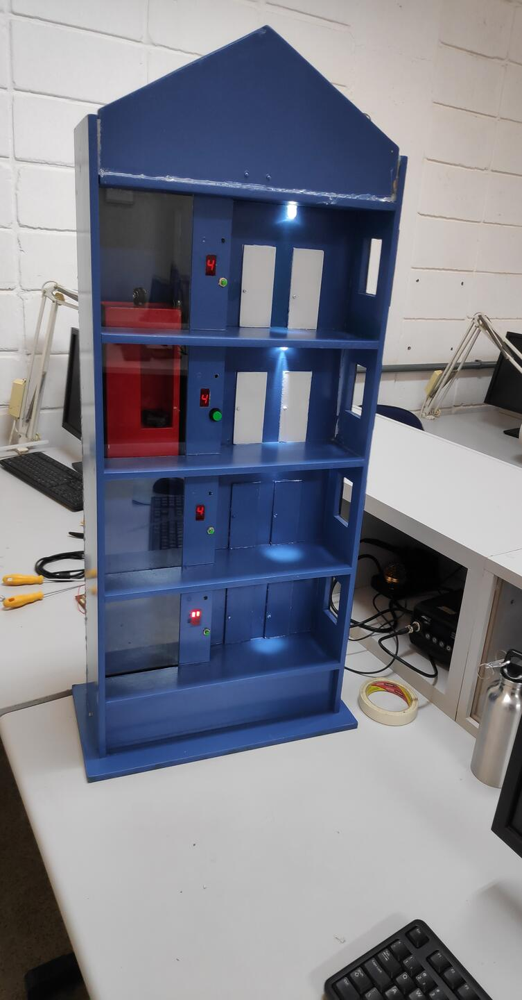

# Elevator with arduino

This is a project I helped by coding for some friends of mine from my former school.
We created that to a thecnology week to demonstrate what we were doing on the eletronics course.

My friends were in charge of doing eletric/eletronic part of the project, and I created the code that you can see on the `.ino` file.

The operation is simple, you only need to click on a button to select a floor and, when the elevator reach the selected floor, you'll be able to select another one, as a common elevator.

## Demonstration

https://user-images.githubusercontent.com/75098594/193454695-da2093b5-357b-4aa3-b0b5-98036e6be475.mp4

